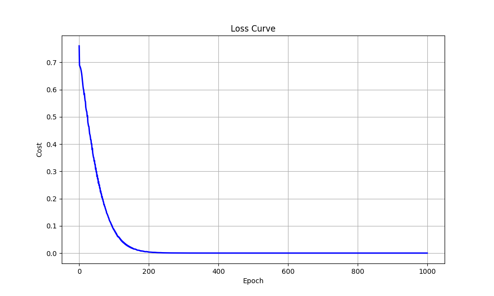
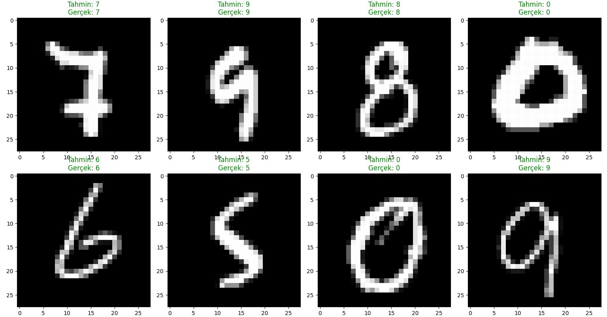

# Neural Network From Scratch (NumPy) 

A modular, fully-connected neural network library built entirely from scratch using **NumPy**.

This project focuses on understanding the mathematical foundations of deep learning by implementing every component manually — without TensorFlow or PyTorch.

---

## Motivation

High-level frameworks hide the mechanics.

This project exposes them.

- Manual forward propagation  
- Manual backpropagation (chain rule)  
- Stable Softmax implementation  
- Optimized Softmax + Cross Entropy gradient  
- Mini-batch Gradient Descent  

If you want to truly understand how neural networks work under the hood, this is it.

---

## Features

- **Dense (Fully Connected) Layers**
- **Activations**
  - ReLU
  - Sigmoid
  - Softmax
- **Loss Functions**
  - Mean Squared Error (MSE)
  - Binary Cross Entropy (BCE)
  - Categorical Cross Entropy (CCE)
- **Mini-batch Gradient Descent**
- **Numerical Stability Improvements**
  - Softmax shifting
  - Log clipping
- **Optimized Gradient**
  - For Softmax + CCE:  
    `dZ = y_hat - y`

---

## Results

### XOR Classification
- Achieved **100% accuracy**
- Successfully learned non-linear decision boundary



---

### MNIST Digit Classification
- Achieved approximately **90–95% test accuracy**



> Top: Model predictions  
> Bottom: Training loss curve  

---
## Mathematical Overview

The backpropagation core relies on the following gradients for each layer $l$:
$$
dW^{[l]} = \frac{1}{m} dZ^{[l]} \cdot (A^{[l-1]})^T
$$

$$
db^{[l]} = \frac{1}{m} \sum dZ^{[l]}
$$

$$
dA^{[l-1]} = (W^{[l]})^T \cdot dZ^{[l]}
$$
For the output layer using Softmax + Categorical Cross-Entropy, the gradient simplifies to:
$$dZ_{final} = \hat{y} - y$$
---
## Project Structure

```
neural-network-from-scratch/
│
├── nn/                 
│   ├── layers.py       
│   ├── activations.py  
│   ├── losses.py       
│   └── utils.py        
│
├── examples/           
│   ├── train_xor.py
│   └── train_mnist.py
│
├── images/
│   ├── xor_loss.png
│   └── mnist_predictions.png
│
└── README.md
```

---

## How to Run

### XOR Example
```bash
python examples/train_xor.py
```

### MNIST Example
```bash
python examples/train_mnist.py
```

---

##  Future Improvements

- He Initialization  
- L2 Regularization  
- Dropout  
- Early Stopping

---

## Goal of This Project

This is not meant to compete with PyTorch.

It’s meant to build intuition.

When you understand this implementation, frameworks stop being magic — they become tools.
